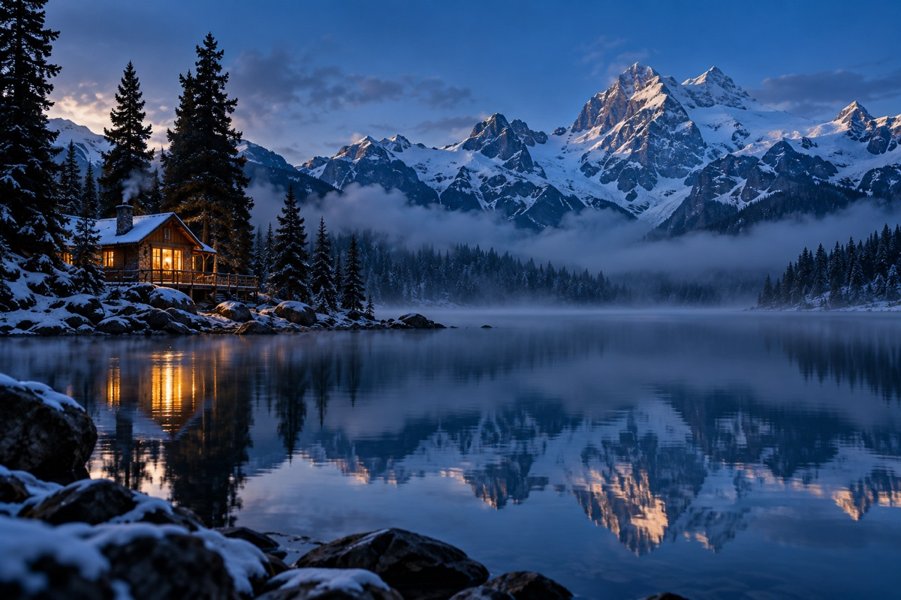
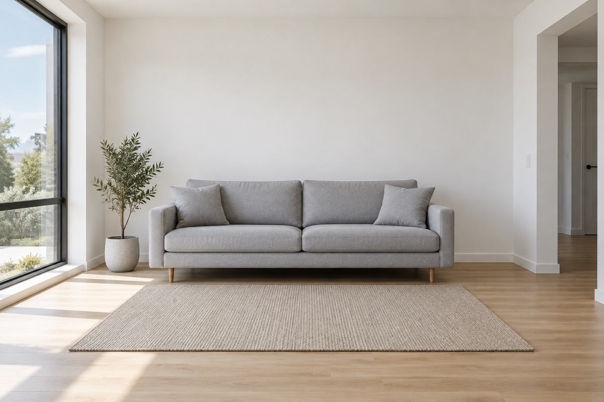
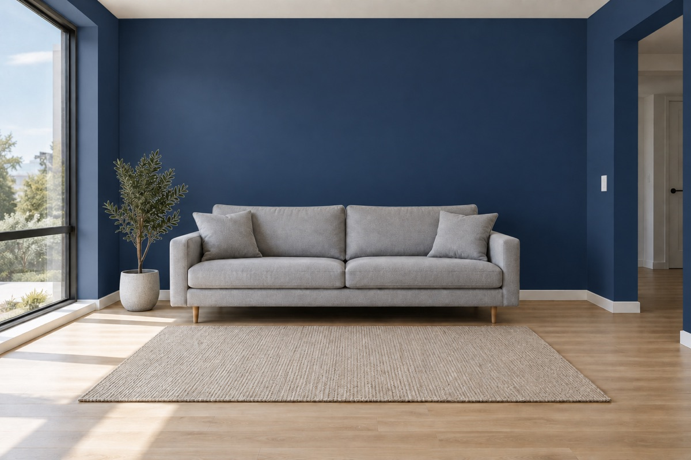

# codex-image-skills

**Generate and edit images inside Claude Code using your ChatGPT Plus subscription — no OpenAI API key.**

Ask Claude Code for an image in plain language. It writes a detailed prompt, generates it with OpenAI's image model (`gpt-image-2`) through your own ChatGPT account and shows it in the chat. Or it saves it straight into your project's asset folder, matching the project's colors and style.



## Why

- You already pay for ChatGPT Plus, but the Images API is billed separately.
- This uses the image quota that comes with your subscription, in two ways:
  - **Codex quota**: runs `codex exec` with Codex's built-in `$imagegen` skill. No browser and nothing left in your history.
  - **ChatGPT quota**: drives chatgpt.com in your logged-in Chrome via [`chrome-use`](https://github.com/leeguooooo/chrome-use). The conversation is archived afterwards.
- Claude never screenshots or clicks your screen. Everything runs through small Python scripts (stdlib only) with short output, so it costs few Claude tokens.

## Examples

All images below were generated with these skills.

| Icon (`1024x1024`) | Edit with a reference image |
|---|---|
|  |   |
| *"Minimalist app icon of a blue rocket, flat vector, blue gradient"* | *"Paint the walls navy blue, keep everything else identical"* |

Typical usage in Claude Code:

```text
/codex-image-auto a wide hero image of a cabin by an alpine lake at blue hour
/codex-image-project hero banner for the landing page
/codex-image paint the walls of this room blue   (with a photo pasted in the chat)
```

## Skills

| Command | What it does |
|---|---|
| `/codex-image` | Asks which quota (Codex or ChatGPT), model and reasoning effort to use, then generates. |
| `/codex-image-auto` | No questions. Claude picks quota, model, effort and size, prioritizing quality. |
| `/codex-image-project` | Generates assets for the open project. Reads its image folder, colors and existing images, and saves files with descriptive names (`public/images/hero-sports.png`). |
| `/codex-update-models` | Refreshes the list of available models and effort levels (Codex from a local file, ChatGPT from the model menu, without sending a message). |

All skills accept reference images (pasted in the chat or by file path) and can edit an existing image (`--editar`).

## Install

**Requirements**

- macOS, `python3`, `git`, and [Claude Code](https://claude.com/claude-code).
- [Codex CLI](https://github.com/openai/codex) logged in with your ChatGPT account: `codex login`.
- Optional, for the ChatGPT quota: Chrome logged in to chatgpt.com, plus [`chrome-use`](https://github.com/leeguooooo/chrome-use) and its extension.

**One-line install**

```bash
curl -fsSL https://raw.githubusercontent.com/almeidasrenato/codex-image-skills/main/install.sh | sh
```

Or clone and run it:

```bash
git clone https://github.com/almeidasrenato/codex-image-skills && cd codex-image-skills && ./install.sh
```

The installer copies the skills to `~/.claude/skills/` and the scripts to `~/.claude/codex-image/`. Then, in Claude Code, run once:

```text
/codex-update-models
```

To update, run the installer again.

## How it works

```text
Claude Code skill ──> python3 ~/.claude/codex-image/gerar.py --cota codex|gpt --prompt "..." --tamanho 1536x1024
                         │
                         ├─ codex:  codex exec --ephemeral + $imagegen (gpt-image-2)
                         └─ gpt:    chrome-use drives chatgpt.com, downloads the image, archives the chat
                         │
                         └─> prints only the PNG path (or ERRO + COMO CORRIGIR with a fix)
```

- Sizes follow `gpt-image-2` rules (sides multiple of 16, aspect ratio up to 3:1, at least 655,360 pixels). The script adjusts the requested size automatically. Use `--exato` to resize to exact pixels.
- Script flags: `--modelo`, `--esforco`, `--tamanho WxH`, `--pasta DIR`, `--nome NAME`, `--ref IMG` (repeatable), `--ref-chat`, `--editar`.

## Notes

- Skill instructions and script messages are in Portuguese (Brazil). Claude reads them fine in any language, and replies in yours.
- Each image uses your ChatGPT plan's image quota, not Claude tokens.
- The ChatGPT path depends on chatgpt.com's current menu. If it changes, run `/codex-update-models`.

Not affiliated with OpenAI or Anthropic.

## License

[MIT](LICENSE)
